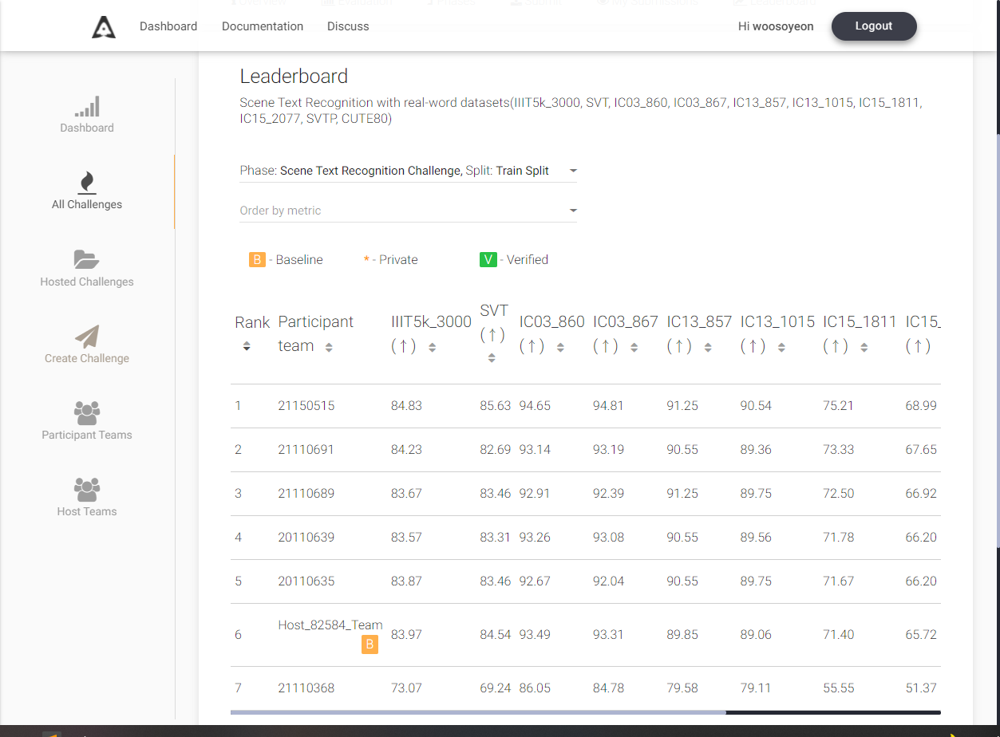

# Scene_Text_Recognition

2021년 2학기 컴퓨터비전의 텀프로젝트 Scene_Text_Recognition 코드 원복 저장소 입니다.

## Env

본체 GPU RTX3090에 맞춰 torch와 torchvision을 설정한 뒤, 추가적인 라이브러리를 install 했습니다.

## Process

train -> predict 로 진행하며, 최종 predict를 이용해 생성한 submission 파일을 리더보드에 제출했습니다.

predict에 사용된 모델은 predict을 통해 발생한 vitstr_tiny_patch16_224-Seed1111의 best_accuracy.pth입니다. 

## Leader board
리더보드 제출 기록 사진 입니다

